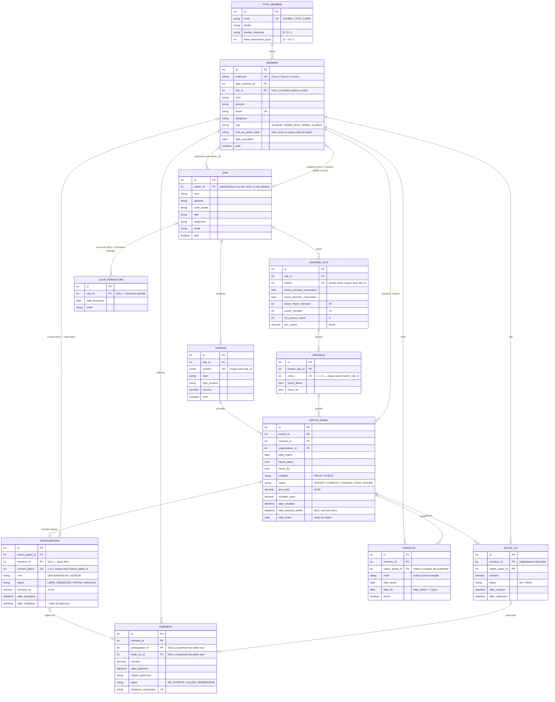

# Gestion de terrains de padel — MCD / ERD (Mermaid)

## Traçabilité règles de gestion -> modèle

| Règle de l'énoncé | Où elle vit |
|---|---|
| N sites, nombre de terrains variable | `SITE 1-N TERRAIN` |
| Horaires propres au site, valables une année civile | `HORAIRE_SITE (site_id, annee)` |
| Durée 1h30 + 15 min entre matches, heure de début/fin par site | `HORAIRE_SITE.duree_match_minutes / pause_minutes / heure_premiere_reservation / heure_derniere_reservation` -> génération des `CRENEAU` |
| Jours de fermeture par site **et** globaux | `JOUR_FERMETURE.site_id` nullable |
| Match privé ou public | `MATCH_PADEL.visibilite` (+ `date_bascule_public`) |
| 4 joueurs obligatoires | 4 lignes `PARTICIPATION` par match (`numero_place` 1..4) |
| Le réservataire est responsable | `MATCH_PADEL.organisateur_id` + `PARTICIPATION.role = ORGANISATEUR` |
| Pénalité 1 semaine si privé incomplet | `PENALITE` (date_debut/date_fin, `active`) |
| 60 € payés d'avance, divisés par 4 | `HORAIRE_SITE.prix_match`, `MATCH_PADEL.prix_total`, `PARTICIPATION.montant_du` |
| Non-payé la veille -> place libérée, match public | `PARTICIPATION.statut`, `MATCH_PADEL.date_limite` + bascule `visibilite` |
| Public : validation dès le paiement, 1er payé = 1er servi | `PARTICIPATION.date_validation` alimentée par `PAIEMENT` |
| L'organisateur paie le solde si places non vendues | `SOLDE_DU` |
| Pas de réservation tant qu'un solde est dû ; solde ajouté au prochain paiement | `SOLDE_DU.statut` + `PAIEMENT.solde_du_id` |
| Membre site / global / libre, délais 3 sem. / 2 sem. / 5 jours, préfixe matricule | `TYPE_MEMBRE` (table de règles) + `MEMBRE.matricule` |
| Abonné à un site mais aussi globalement | `MEMBRE.site_id` (NULL = membre global ou libre) + `TYPE_MEMBRE.code` |
| Admin global et admin par site | `SITE.admin_id` -> `MEMBRE` pour l'admin de site ; `MEMBRE.role = ADMIN_GLOBAL` pour l'admin global |
| Pas de login user, uniquement matricule | `MEMBRE.matricule` en contrainte d'unicité ; `mot_de_passe_hash` NULL pour un joueur |

## Hypothèses posées

1. **Toutes les clés primaires sont des identifiants techniques** (`int id`, auto-incrémenté). Les clés naturelles de l'énoncé — `matricule`, `TYPE_MEMBRE.code`, `TERRAIN.numero`, `CRENEAU.ordre` — deviennent des contraintes d'unicité. Aucune clé étrangère ne porte donc de sens métier.
2. Une seule plage horaire (début/fin) par site et par année civile ; les créneaux sont dérivés mécaniquement (90 + 15 min) et matérialisés dans `CRENEAU` pour pouvoir poser une contrainte d'unicité `(terrain, date, créneau)`.
3. Le prix (60 €), la durée, la pause et le nombre de joueurs sont paramétrés dans `HORAIRE_SITE` (donc par site et par année) plutôt qu'en dur dans le code.
4. Les 4 places d'un match sont créées à la création du match ; une place libre = `membre_id NULL`.
5. Les délais de réservation (21 / 14 / 5 jours) sont des données (`TYPE_MEMBRE`), pas du code.
6. Le type d'un membre est figé par son matricule : un membre site est rattaché à **un seul** site (`MEMBRE.site_id`), un membre global ou libre à aucun (`site_id NULL`). Pas d'historique d'abonnement.
7. Pas de table `ADMINISTRATEUR` : l'administrateur d'un site est un `MEMBRE` désigné par `SITE.admin_id`, et l'administrateur global est un `MEMBRE` de `role = ADMIN_GLOBAL`. `mot_de_passe_hash` n'est rempli que pour ces comptes, les joueurs s'identifiant par matricule seul.
8. Un match occupe exactement un terrain et un créneau ; unicité `(terrain_id, date_match, creneau_id)` hors matches annulés.
9. `MATCH_PADEL` plutôt que `MATCH` : `MATCH` est un mot réservé SQL (MySQL).